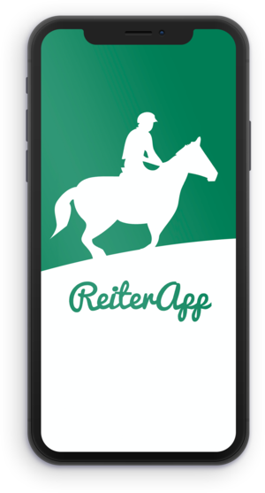
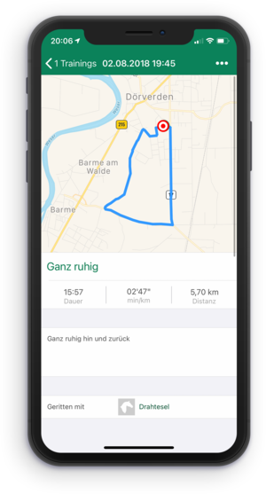
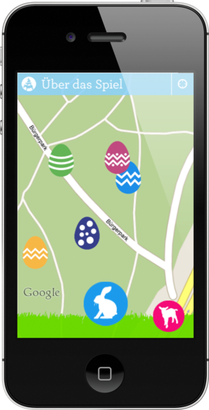
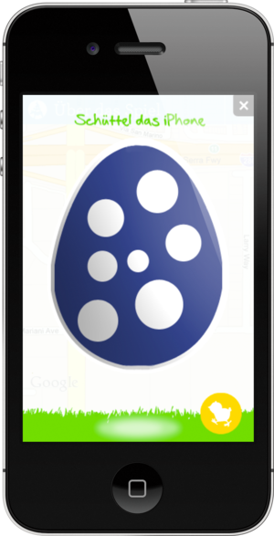
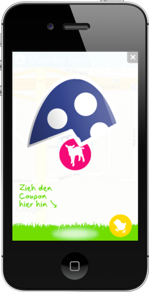
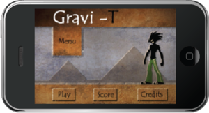
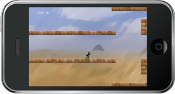

# Projects

## RiderApp (2014)

As a founder of out there! communication UG, I was involved in the development of the RiderApp, a social network for trail riders. In 2014, the RiderApp was commissioned by Noma GmbH from out there! communication UG, which was a shareholder at the time. I programmed parts of the app in Objective-C, and my specific contribution to the project included the map interaction feature, which used MapKit, CoreLocation, and MapBox to allow users to interact with maps within the app. Unfortunately, the RiderApp was discontinued in 2022. Through the RiderApp, trail riders were able to connect with each other, share information about trails and rides, and potentially plan group rides or events.

  

## cubodo (2012)

Cubodo is a game that involves transporting virtual packages over real-world distances. In the game, players can create their own packages or pick up packages from other players and transport them to different locations. To earn points and progress in the game, players must drop off the packages and add content to them by taking a picture. The app uses MapKit, CoreLocation, and other technologies to track the movement of the packages and allow players to interact with them on a map. My specific contributions to the project included the map interaction, user account management, and the REST-like communication with the backend, which was implemented using the CakePHP framework. Cubodo was developed as a master project at the University of Applied Sciences Bremen, and the success of the project led to the formation of the startup out there! communication UG.

  
  
  

## Easter Egg Hunt Bremen 2011 

I was involved in the development of the Easter Egg Hunt Bremen 2011 app, which was an innovative treasure hunt event. Virtual Easter eggs were scattered across ten areas in Bremen and could be seen on the app within a range of five meters. By tapping on an Easter egg and then shaking their iPhone, players could redeem one of three coupons. The app was programmed in Objective-C and used technologies such as UIKit, MapKit, CoreLocation, and CoreData. My specific contributions to the project included the map interaction, user account management, and the REST-like communication with the backend. The backend was implemented using the CakePHP framework.

  

## GRAVI-T (2010)

GRAVI-T is a mobile game developed as part of a group project at the University of Applied Sciences Bremen. As the player, you must navigate the game character through a continuous obstacle world by tapping on the screen to reverse the gravity. I was responsible for animating the game character and displaying the highscore. GRAVI-T was programmed using Objective-C and the Cocos2D game engine.

  
